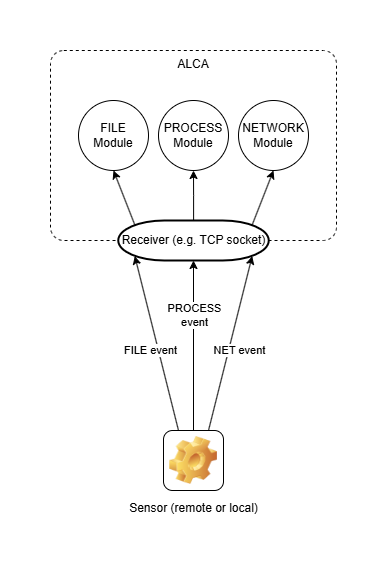

## Sensors

A sensor is a program or service responsible for executing a file and reporting actions and state changes back to ALCA.
These reports are in the form of events, which can be in any format. A sensor would have one or more corresponding
'modules' that are responsible for decoding these events, for ALCA's engine to interpret. You may think of sensors
and modules in a provider-consumer model: there can be multiple consumers, but only one provider at a time.

You may wish to use one sensor that provides a range of event types, or multiple sensors that each specialise in a 
particular event type - for example, by providing more granular / technical details regarding an event.

### Modules

A module is an object used by ALCA to unmarshal / deserialize event data received from a sensor. One module is
responsible for precisely one event type. However, a sensor can provide events of multiple types, as long as there
is a module corresponding to each event type.

More information about writing sensors and modules will be available at a later stage, as ALCA's flagship sensor is
currently in active development.
